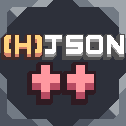

# Hjson++

a library that adds new classes to work with!
classes that are added:

- AdvancedConsumeGenerator - you can now output items/liquids and make craft progress bar. 
variables: outputItem/Items/Liquid/Liquids, progressBar: true/false
- AdvancedHeaterGenerator - basically the same version as HeaterGenerator but have same things as previous class
variables: outputItem/Items/Liquid/Liquids, progressBar (boolean)
- TileGenerator - placeable on only specific tiles
variables: floors: []
- AdvancedCoreBlock - basically you can use drawers
variables: drawers
- GeneratorCoreBlock - basic core block but it can generate power
variables: powerProduction: n
- AccelTurret - turret which have acceleration
variables: speedUpPerShoot: n, maxAccel: n, cooldownSpeed: n
- DrawTeam - drawer class. Draws -team sprite

- ## NEW!
- ColliderCrafter - basic GenericCrafter but it outputs items/liquids with specific chance.
variables: produceChance: n (1=100%)
- OverHeatTurret - Turret which overheats after some shoots.
variables: overHeatAmount: n, timeToCooldown: n
- AdjustableShieldWall - Basic shield wall, but you can turn it on and off. and can justify shield radius
variables: radius: n
- EffectWeapon - Weapon class where you can set a list of effects which will always be shown on unit. 
variables: effects: [], effectInterval: n, effectX: n, effectY: n
- TiledFloor - deprecated Anuken class. Can make big floors (64x64 etc)
variables: tilingVariants: n, tilingSize: n

# WARNING
this library is still WIP. report all errors to [IJT team mods discord server](https://discord.gg/btUe3rhGuQ)